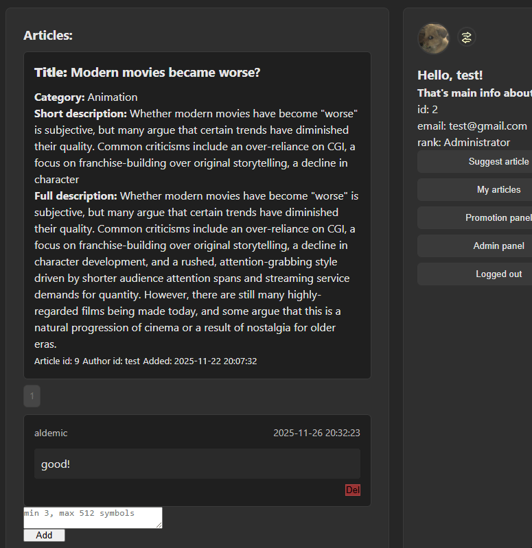
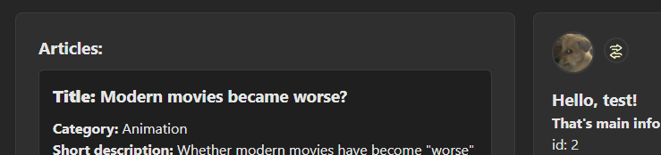

📝 Articles Module

## 🧩 Description

A simple articles module with a publication approval system. Users can submit articles, earn approval, and increase their rank.

Each rank carries a different voting weight during moderation. For example:

- Moderator: ±3 points

- Administrator: ±5 points

The status of an article (approved/declined) is calculated based on the sum of votes:

- Sum ≥ 10 → Approved

- Sum ≤ -5 → Declined

This system encourages users to contribute high-quality content and gain higher ranks over time.

## 🖋 Features

- user registration and login with sessions;

- admin panel for article moderation;

- database storage (MySQL via PDO);

- user avatar upload and management;

- rank progression system based on article approvals;

- article comments (with admin-only delete functionality);

- search functionality across articles;

- article categories;

- pagination for articles listing.

## ⚙️ Technologies

* PHP (PDO) — backend logic & secure database interaction

* MySQL — data storage (users, articles, ranks, comments, votes)

* JavaScript (ES6) — dynamic frontend, fetch() API calls, JSON handling

* HTML5 & CSS3 — layout and styling

* Sessions — for user state management

* Fetch API + JSON — asynchronous client-server communication

## 🧱 Database

The module requires a MySQL database with the following main tables:

- users — user information, avatar, rank, and authentication data;

- articles — article content, author, category, and moderation status;

- a_catgries — list of available categories;

- a_comments — user comments linked to articles;

- moderation_decisions — votes and moderation history;

- ranks — user ranks and voting weights.

Database dumps and structure can be found in:

📁 /sql/

To import it:
- mysql -u root -p articles < sql/sql.sql
- or use phpMyAdmin and restore "clear" backup: sql/articles(phpMyAdmin-dump).sql

## 📸 Demonstration

## 📸 Screenshots
- Additional screenshots can find in same folder: /screenshots/

## ⚙️ Running the Module(!)

1. Launch your local server (Apache/Nginx with PHP support or OSPanel).

2. Import the provided database dump (articles(phpMyAdmin-dump).sql or sql.sql).

3. Configure your database credentials inside core/db.php.

4. Open your browser at your local host address (e.g., http://localhost/articles/).

Register or log in, then start submitting articles and interacting with the module.

- ⚠️ The module uses asynchronous fetch() calls for updating articles, avatars, and comments. It must run via a local server. Opening index.php directly from your filesystem will not work.
